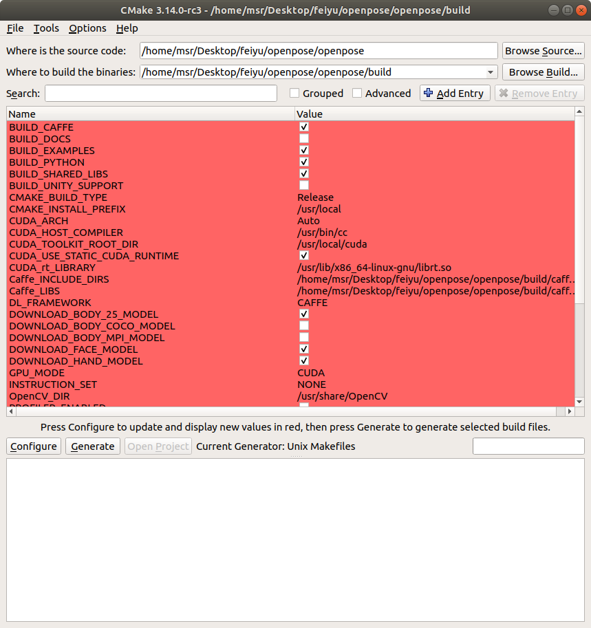
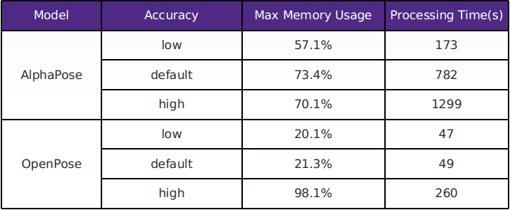

# Install dependencies
* Python version: Python 3.6.7
* pip3 install pandas
* pip3 install -U scikit-learn
* pip3 install --user --upgrade tensorflow
* sudo -H pip3 install keras
* Got numpy error. Solved by **pip3 uninstall numpy**. Then run **pip3 show numpy**, find that numpy is still installed.


# Framework
 In this project, we aim at doing **Human Pose Estimation** and **action recognition** in video. We use **OpenPose** and **AlphaPose** to estimate human pose. These two models both detect the keypoints of people and then link all keypoints to get the human skeleton. We extract the coordinates of keypoints in each frame and feed them into the action recognition model to estimate human action in video.

 We have both on-line and off-line versions for this project. The on-line version requires high inference speed so we set the accuracy relative lower while the off-line version can achieve high accuracy by slowing down the inference speed.

# AlphaPose
## Introduction

 [AlphaPose](https://github.com/MVIG-SJTU/AlphaPose) is an accurate multi-person pose estimator, which is the first real-time open-source system that achieves 70+ mAP (72.3 mAP) on COCO dataset and 80+ mAP (82.1 mAP) on MPII dataset. To match poses that correspond to the same person across frames, AlphaPose also provides an efficient online pose tracker called Pose Flow. It is the first open-source online pose tracker that achieves both 60+ mAP (66.5 mAP) and 50+ MOTA (58.3 MOTA) on PoseTrack Challenge dataset.

## Installation
The general version Installation of AlphaPose can be found [here](https://github.com/MVIG-SJTU/AlphaPose)

The version we use for this project is [PyTorch version](https://github.com/MVIG-SJTU/AlphaPose/tree/pytorch), see the installation [here](https://github.com/MVIG-SJTU/AlphaPose/tree/pytorch). As required at the second step, you may want to use
```
pip install -r requirements.txt
```
to install the dependencies it needs. However, you may run into some issues that not all the dependencies be installed successfully. Our advice is to try to install them line by line. The 9th line of **requirements.txt** - ntpath is included in **python os module**, so if you already have os, you don't need to reinstall it.

 See more details about the usage & examples of AlphaPose [here](https://github.com/MVIG-SJTU/AlphaPose/blob/pytorch/doc/run.md). You can choose different hyperparameters to increse the accuracy while slowing down the inference speed and vice versa.

# Openpose
## Introduction

 OpenPose represents the first real-time multi-person system to jointly detect human body, hand, facial, and foot keypoints (in total 135 keypoints) on single images. It is an on-going open source project of CMU-Perceptual-Computing-lab. It also supports C++ and Python API for customized implement.

## Installation
 Check the general installation [here](https://github.com/CMU-Perceptual-Computing-Lab/openpose/blob/master/doc/installation.md). Make sure to download and install the prerequisites for your particular operating system following [prerequisites.md](https://github.com/CMU-Perceptual-Computing-Lab/openpose/blob/master/doc/prerequisites.md).
### **Important Tips**
 1. For Ubuntu: Anaconda should not be installed on your system. Anaconda includes a Protobuf version that is incompatible with Caffe. Either you uninstall anaconda and install protobuf via apt-get, or you compile your own Caffe and link it to OpenPose. Additionally, the compatible version should be 3.6.1. Check the package version by
```
pip show protobuf
```
 2. After you install **CMake GUI**: Assuming your CMake downloaded folder is in {CMAKE_FOLDER_PATH}, everytime these instructions mentions Cmake-gui, you will have to replace that line by {CMAKE_FOLDER_PATH}/bin/cmake-gui.

 <p align="center">
   
 </p>

 3. At OpenPose Configuration step, make sure the `BUILD_PYTHON` flag is set in Cmake-gui if you want to install Python API. However, it sometimes may not work. Go into your /build/python directory and try
```
sudo make install
```
 to build **openpose** Python API. It will by default build its path to /usr/local/python, so you would add this to your environmental variables:
```
export PYTHONPATH=/usr/local/python/:$PYTHONPATH
```
 If you are on Ubuntu or OSX, you can add this to your `.bashrc`. To verify if the API is successfully added to your path, check if there is any error when you import it in python:
```
import openpose as op
```

## Output
Information about output (format, keypoint index ordering, etc.) is on [this page](https://github.com/CMU-Perceptual-Computing-Lab/openpose/blob/master/doc/output.md).

## Benchmark: AlphaPose VS OpenPose


### Multi-person


<p align="center">
  
</p>
<p align="center">
  <b>Benchmark on a 1920x1080 video with 902 frames, 30fps</b><br>
</p>

**AlphaPose:**

In your /AlphaPose directory, run:

Default version:

`
python3 video_demo.py --video {input_dir} --outdir {output_dir} --save_video --detbatch 9 --sp
`

High accuracy version:

`
python3 video_demo.py --video {input_dir} --outdir {output_dir} --save_video --nms 1.0 --detbatch 9 --sp
`

Low accuracy version:

`
python3 video_demo.py --video {input_dir} --outdir {output_dir} --save_video --conf 0.9 --nms 0.1 --detbatch 9 --sp
`

**openpose:**

In your /openpose directory, run:

Default version:

`
/build/examples/openpose/openpose.bin --video {input_dir} --num_gpu 1 --num_gpu_start 0 --write_video {output_dir}
`

High accuracy version:

`
command: ./build/examples/openpose/openpose.bin --video {input_dir} --num_gpu 1 --num_gpu_start 1 --write_video {output_dir} --net_resolution "1312x736" --scale_number 4 --scale_gap 0.25
`

Low accuracy version:

`
./build/examples/openpose/openpose.bin --video {input_dir} --num_gpu 1 --num_gpu_start 1 --write_video {output_dir} --net_resolution "-1x368" --scale_number 1 --scale_gap 0.25
`

### Single-person:

<p align="center">
  
</p>
<p align="center">
  <b>Benchmark on a 1920x1080 video with 902 frames, 30fps</b><br>
</p>


**Single-person:**

**AlphaPose:**

In your /openpose directory, run:

Default version:

`
python3 video_demo.py --video {input_dir} --outdir {output_dir} --save_video --detbatch 9 --sp
`

High accuracy version:

`
command: python3 video_demo.py --video {input_dir} --outdir {output_dir} --save_video --nms 1.0 --detbatch 9 --sp
`

Low accuracy version:

`
python3 video_demo.py --video {input_dir} --outdir {output_dir} --save_video --conf 0.9 --nms 0.1 --detbatch 9 --sp
`

**openpose:**

In your /openpose directory, run:

Default version:

`
command: ./build/examples/openpose/openpose.bin --video {input_dir} --num_gpu 1 --num_gpu_start 0 --write_video {output_dir}
`

High accuracy version:

`
command: ./build/examples/openpose/openpose.bin --video {input_dir} --num_gpu 1 --num_gpu_start 1 --write_video {output_dir} --net_resolution "1312x736" --scale_number 4 --scale_gap 0.25
`

Low accuracy version:

`
./build/examples/openpose/openpose.bin --video {input_dir} --num_gpu 1 --num_gpu_start 1 --write_video {output_dir} --net_resolution "-1x368" --scale_number 1 --scale_gap 0.25
`
