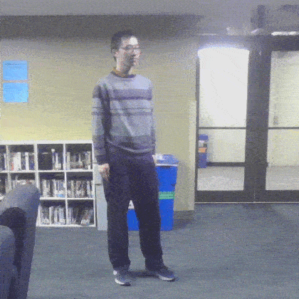
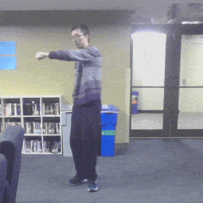
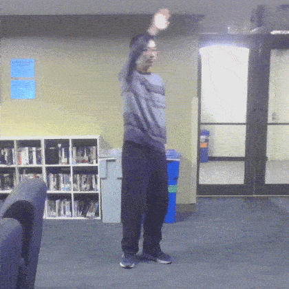
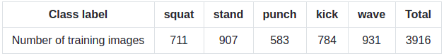

# Human Pose Estimation Benchmarking and Action Recognition
#### Deep Learning Project, Winter 2019, Northwestern University
#### Group members: Chenge Yang, Zhicheng Yu, Feiyu Chen
-----------------------------------------------------------------------------------------
## Results
### 1. Human Pose Estimation Benchmarking
#### Multi-Person (left: AlphaPose, right: OpenPose)
<p align = "center">
  
  
</p>

#### Single-Person (left: AlphaPose, right: OpenPose)
<p align = "center">
  
  
</p>

### 2. Action Recognition
<p align = "center">
  
</p>

-----------------------------------------------------------------------------------------
## Introduction
This project contain two main parts:
### 1. Human Pose Estimation Benchmarking
In this part, we conducted benchmarking test on the two most state-of-the-art human pose estimation models [OpenPose](https://github.com/CMU-Perceptual-Computing-Lab/openpose) and [AlphaPose](https://github.com/MVIG-SJTU/AlphaPose). We tested different modes on both single-person and multi-person scenarios.

### 2. Online Skeleton-Based Action Recognition
Real-time multi-person human action recognition based on [tf-pose-estimation](https://github.com/ildoonet/tf-pose-estimation). The pipeline is as follows:
* Real-time multi-person pose estimation via tf-pose-estimation
* Feature Extraction
* Multi-person action recognition using TensorFlow / Keras

-----------------------------------------------------------------------------------------
## Dependencies and Installation
#### 1. Human Pose Estimation Benchmarking
Check the [installation_benchmarking.md](doc/installation_benchmarking.md).

#### 2. Online Skeleton-Based Action Recognition
Check the [installation_action_recognition.md](doc/installation_action_recognition.md).

-----------------------------------------------------------------------------------------
## Usage
### Human Pose Estimation Benchmarking
* Check the [command_benchmarking.md](doc/command_benchmarking.md) for the running commands we used.
* Check the official website of [OpenPose](https://github.com/CMU-Perceptual-Computing-Lab/openpose) and [AlphaPose](https://github.com/MVIG-SJTU/AlphaPose) for more detailed running options.

### Training Action Recognition Model
* Copy your dataset (must be .csv file) into [/data](data/) folder
* Run [training.py](src/training.py) with the following command:
```
python3 src/training.py --dataset [dataset_filename]
```
* The model is saved in [/model](model/) folder

### Real-time Action Recognition
* To see our multi-person action recognition result using your webcam, run [run_detector.py](src/run_detector.py) with the following command:
```
python3 src/run_detector.py --images_source webcam
```

-----------------------------------------------------------------------------------------
## Benchmarking Results
### Requirements
* 0S: Ubuntu 18.04
* CPU: AMD Ryzen Threadripper 1920X (12-core / 24-thread)
* GPU: Nvidia GTX 1080Ti - 12 GB
* RAM: 64GB
* Webcam: Creative 720p Webcam

### 1. Multi-person
<p align="center">
  
</p>
<p align="center">
  <b>Benchmark on a 1920x1080 video with 902 frames, 30fps</b><br>
</p>

### 2. Single-person
<p align="center">
  
</p>
<p align="center">
  <b>Benchmark on a 1920x1080 video with 902 frames, 30fps</b><br>
</p>

-----------------------------------------------------------------------------------------
## Implementation (Action Recognition)
### Collecting training data
we collected 3916 training images from our laptop's webcam for training the model and classifying five actions: squat, stand, punch, kick, and wave. In each training image, there is only one person doing one of these 5 actions. The videos are recorded at 10 fps with a frame size of 640 x 480, and then saved to images.

The examples and the numbers of training images for each action class are shown below:  

|squat |stand |punch |kick |wave |
|:---:|:---:|:---:|:---:|:---:|
||  |  |  |  |

<p align="center">
  
</p>

### Get Skeleton from Image
We used [tf-pose-estimation](https://github.com/ildoonet/tf-pose-estimation) to detect the human pose in each training image. The output skeleton format of OpenPose can be found at [OpenPose Demo - Output](https://github.com/CMU-Perceptual-Computing-Lab/openpose/blob/master/doc/output.md).

The generated training data files are located in [data](data/) folder:
* [skeleton_raw.csv](data/skeleton_raw.csv): original data
* [skeleton_filtered.csv](data/skeleton_filtered.csv): cleaned data where incomplete poses are eliminated

### Feature Extraction
To transfer the original skeleton data into the input of our neural network, three features are extracted, which are implemented in [data_preprocessing.py](src/mylib/data_preprocessing.py) :
1. Head reference: all joint positions are converted to the x-y coordinates relative to the head joint.
2. Pose to angle: the 18 joint positions are converted to 8 joint angles: left / right shoulder, left / right elbow, left / right hip, left / right knee.
3. Normalization: all joint positions are converted to the x-y coordinates relative to the skeleton bounding box.

The third feature is used, which gives the best result and robustness.

### Deep Learning model
We built our Deep Learning model refering to [Online-Realtime-Action-Recognition-based-on-OpenPose](https://github.com/LZQthePlane/Online-Realtime-Action-Recognition-based-on-OpenPose). The model is implemented in [training.py](src/training.py) using Keras and Tensorflow. The model consists of three hidden layers and a Softmax output layer to conduct a 5-class classification.

The generated model is saved in [model](model/) folder.

-----------------------------------------------------------------------------------------
## Acknowledgement
* [OpenPose](https://github.com/CMU-Perceptual-Computing-Lab/openpose)
* [AlphaPose](https://github.com/MVIG-SJTU/AlphaPose)
* [tf-pose-estimation](https://github.com/ildoonet/tf-pose-estimation)
* [Online-Realtime-Action-Recognition-based-on-OpenPose](https://github.com/LZQthePlane/Online-Realtime-Action-Recognition-based-on-OpenPose)
