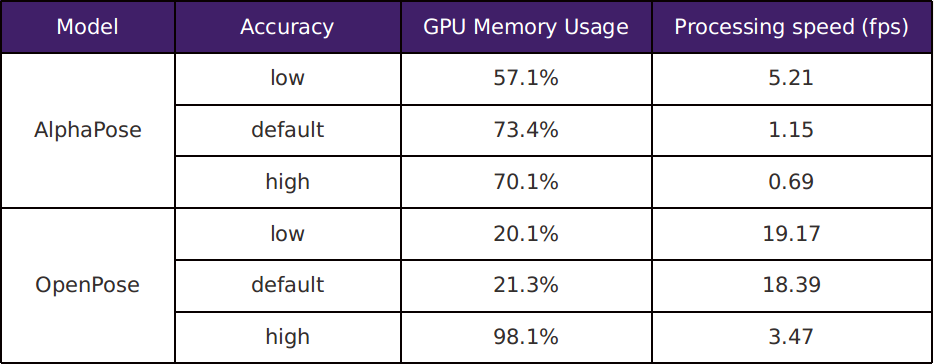
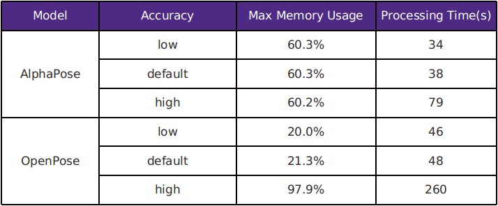

# Benchmarking: AlphaPose VS OpenPose

## Multi-person
#### Benchmarking Results
<p align="center">
  
</p>
<p align="center">
  <b>Benchmark on a 1920x1080 video with 902 frames, 30fps</b><br>
</p>

### Running commands
#### AlphaPose
Run the following commands in your /AlphaPose directory:
* Default version:
```
python3 video_demo.py --video {input_dir} --outdir {output_dir} --save_video --detbatch 9 --sp
```
* High accuracy version:
```
python3 video_demo.py --video {input_dir} --outdir {output_dir} --save_video --nms 1.0 --detbatch 9 --sp
```
* Low accuracy version:
```
python3 video_demo.py --video {input_dir} --outdir {output_dir} --save_video --conf 0.9 --nms 0.1 --detbatch 9 --sp
```

#### OpenPose
Run the following commands in your /OpenpPose directory:
* Default version:
```
/build/examples/openpose/openpose.bin --video {input_dir} --num_gpu 1 --num_gpu_start 0 --write_video {output_dir}
```
* High accuracy version:
```
command: ./build/examples/openpose/openpose.bin --video {input_dir} --num_gpu 1 --num_gpu_start 1 --write_video {output_dir} --net_resolution "1312x736" --scale_number 4 --scale_gap 0.25
```
* Low accuracy version:
```
./build/examples/openpose/openpose.bin --video {input_dir} --num_gpu 1 --num_gpu_start 1 --write_video {output_dir} --net_resolution "-1x368" --scale_number 1 --scale_gap 0.25
```

## Single-person
#### Benchmarking Results
<p align="center">
  
</p>
<p align="center">
  <b>Benchmark on a 1920x1080 video with 902 frames, 30fps</b><br>
</p>

### Running commands:
#### AlphaPose
Run the following commands in your /AlphaPose directory:
* Default version:
```
python3 video_demo.py --video {input_dir} --outdir {output_dir} --save_video --detbatch 9 --sp
```
* High accuracy version:
```
command: python3 video_demo.py --video {input_dir} --outdir {output_dir} --save_video --nms 1.0 --detbatch 9 --sp
```
* Low accuracy version:
```
python3 video_demo.py --video {input_dir} --outdir {output_dir} --save_video --conf 0.9 --nms 0.1 --detbatch 9 --sp
```

#### OpenPose
Run the following commands in your /OpenpPose directory:
* Default version:
```
command: ./build/examples/openpose/openpose.bin --video {input_dir} --num_gpu 1 --num_gpu_start 0 --write_video {output_dir}
```
* High accuracy version:
```
command: ./build/examples/openpose/openpose.bin --video {input_dir} --num_gpu 1 --num_gpu_start 1 --write_video {output_dir} --net_resolution "1312x736" --scale_number 4 --scale_gap 0.25
```
* Low accuracy version:
```
./build/examples/openpose/openpose.bin --video {input_dir} --num_gpu 1 --num_gpu_start 1 --write_video {output_dir} --net_resolution "-1x368" --scale_number 1 --scale_gap 0.25
```
